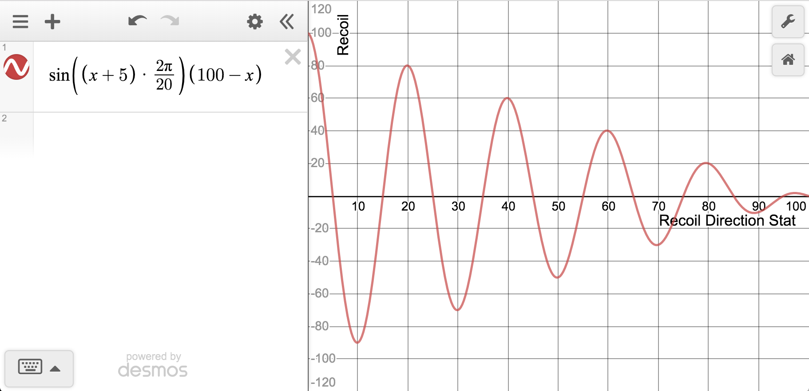

# Destiny 2 Recoil Direction Mechanics

**Repository rule:** Use this reference whenever evaluating barrels, mods, duplicate rolls, practical stat packages, or best-in-slot comparisons. Do not reduce Recoil Direction to either “higher is always better” or “the last digit is all that matters.”

## 1. What Recoil Direction controls

Recoil Direction primarily describes the weapon's **horizontal recoil tendency**:

- which side the pattern tends to favor;
- how strongly it favors that side;
- how close the tendency is to a centered, predominantly vertical path.

It is not the same as Stability.

- **Recoil Direction:** horizontal direction and bias.
- **Stability:** severity of kick, bounce, grouping during sustained fire, and recovery behavior.
- **Accuracy:** how closely fired shots follow the intended point and accuracy cone.

A weapon may have excellent Recoil Direction but still kick sharply because its Stability is low.

## 2. Damped-sine explanatory model

The traditional community model is:

```text
B(x) = sin((x + 5) × 2π / 20) × (100 - x)
```

Equivalent form:

```text
B(x) = sin((x + 5)π / 10) × (100 - x)
```

Where:

- `x` is the **final Recoil Direction stat**, after the active barrel, mod, perk, or other bonus;
- the sign of `B(x)` represents opposite left/right tendencies;
- `|B(x)|` represents the relative strength of the directional bias;
- `(100 - x)` shrinks the possible bias envelope as the stat approaches 100.

This is a durable explanatory model, not a claim that the displayed equation is literally Bungie's current source code. Verify patch-specific exceptions when the sandbox changes.



## 3. Centered values

The sine term crosses zero at values ending in 5:

```text
5, 15, 25, 35, 45, 55, 65, 75, 85, 95
```

These values have no preferred left/right direction in the model. **100 is also centered** because the damping term `(100 - x)` reaches zero.

The familiar “ending in 5 is vertical” rule is therefore useful, but incomplete.

## 4. Values ending in 0

Values ending in 0 lie near alternating positive and negative peaks of the wave:

| Final stat | Model value | Interpretation |
|---:|---:|---|
| 10 | -90 | Very strong tendency toward one side |
| 20 | +80 | Very strong tendency toward the other side |
| 40 | +60 | Strong side tendency |
| 60 | +40 | Noticeable side tendency |
| 80 | +20 | Modest side tendency |
| 90 | -10 | Small opposite-side tendency |
| 100 | 0 | Maximum stat and centered |

The sign tells which side; for vault analysis, the absolute magnitude is normally more important than the sign unless Brent has a personal preference for compensating one direction.

## 5. Why higher is generally—but not monotonically—better

As `x` rises, `(100 - x)` shrinks. This means high values limit the maximum strength of horizontal bias. However, adding Recoil Direction can move a weapon away from a centered node and onto a side-biased part of the wave.

Examples with a `+15` Recoil Direction change:

| Starting stat | Final stat | Result |
|---:|---:|---|
| 65 | 80 | Higher overall stat, but moves from centered to a modest side bias |
| 70 | 85 | Moves to an excellent centered node |
| 80 | 95 | Moves to an extremely strong centered node |
| 85 | 100 | Reaches the ideal endpoint |

Therefore:

> Always evaluate the **final number**, not merely the size of the bonus.

## 6. The 55-versus-90 example

- **55** sits on a centered zero-bias node.
- **90** has a slight side preference, but it is close to 100 and its remaining bias envelope is small.

It is incorrect to declare 55 universally superior merely because it ends in 5. Depending on the weapon, archetype, Stability, input method, and player preference, a tight and predictable 90 may perform better than a lower centered value.

Likewise, do not claim that 90 is universally better solely because it is numerically higher. Test close cases or use the complete practical stat package.

## 7. Stability must be evaluated separately

Illustrative combinations:

- **100 Recoil Direction / low Stability:** predominantly vertical, but may jump hard.
- **75 Recoil Direction / high Stability:** centered with controlled kick, though not at the maximum bias envelope.
- **90 Recoil Direction / high Stability:** slight predictable lean with relatively tight sustained behavior.
- **95 Recoil Direction / high Stability:** usually an excellent centered sustained-fire package.

Recoil Direction cannot by itself predict the complete feel of a weapon.

## 8. Archetype and activity weighting

Weight Recoil Direction more heavily on:

- auto rifles;
- SMGs;
- pulse rifles;
- machine guns;
- other sustained-fire or multi-shot burst weapons;
- PvP weapons where repeated precision hits and predictable tracking matter.

Weight it less heavily on:

- slow semi-automatic weapons where the sight is reacquired between shots;
- rocket-assisted sidearms and other projectile weapons whose practical behavior is dominated by velocity, blast radius, tracking, or projectile path;
- PvE rolls where a defining perk combination overwhelms a small recoil-stat difference.

## 9. Vault-analysis rules

For every close comparison involving Recoil Direction:

1. Use the weapon's **final active/configurable stat**, not only its base stat.
2. Enumerate selectable barrels and relevant mods for Tier 3/4/5 weapons.
3. Record whether each useful configuration lands on a centered node, a mild side bias, or a strong side bias.
4. Evaluate Stability, Range, Handling, magazine, zoom, archetype, input method, and weapon-specific tuning alongside it.
5. Treat Recoil Direction as a meaningful tie-breaker for sustained-fire weapons, especially in PvP.
6. Do not delete a unique or superior role roll solely because another copy has a prettier Recoil Direction number.
7. Do not sacrifice a defining perk combination merely to move an already manageable value from 85 or 95 to 100.
8. When a bonus changes a centered number to a side-biased number, state that tradeoff explicitly.
9. In a dominance claim, explain both the final Recoil Direction and any Stability/stat cost required to obtain it.
10. Test weapon-specific exceptions when practical; displayed stats are not a complete substitute for firing the weapon.

## 10. Currentness note

Deterministic recoil and weapon-specific recoil systems have changed across Destiny 2 sandboxes. The repository's durable rule is to use the standard final-stat model above while **reverifying current patch exceptions** before making a destructive vault decision. Historical/current patch claims should be date-stamped in analysis outputs.
